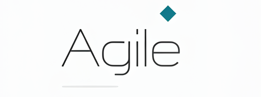

<h1>Grupo Agile</h1> 

<h2>Disciplina</h2>
AS63C - Desenvolvimento Ágil - N13 (2024_02)

<h2>Integrantes:</h2>
<ol>
  <li><a href="https://github.com/AbhimaSi">Abhimael Sidney Setni Rogatti</a></li>
  <li><a href="https://github.com/carlosrenatoalves">Carlos Renato Alves de Oliveira</a>   </li>
  <li><a href="https://github.com/Yuugenbrose">Davi Peres Gomes Leite Barreto</a></li>
  <li><a href="https://github.com/GuilhermeEijiY">Guilherme Eiji Yoshida</a></li>
  <li><a href="https://github.com/Matheus-Barreto06">Matheus Peres Gomes Leite Barreto</a> </li>
  <li><a href="https://github.com/ncqbrbs">Natália Cuqui Barbosaa</a></li>
</ol>

<h2>Projeto</h2>

Sistema destinado ao gerenciamento de alunos do ensino fundamental, que tem como objetivos gerais:

- Cadastro
- Gerencimanento de frequência
- Gerenciamento de notas
